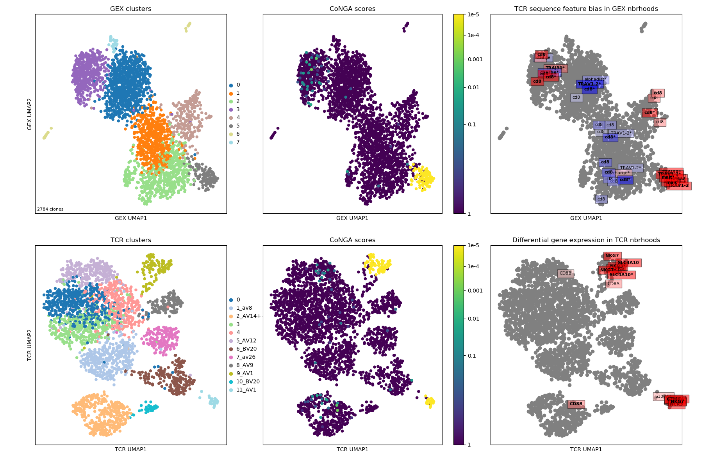
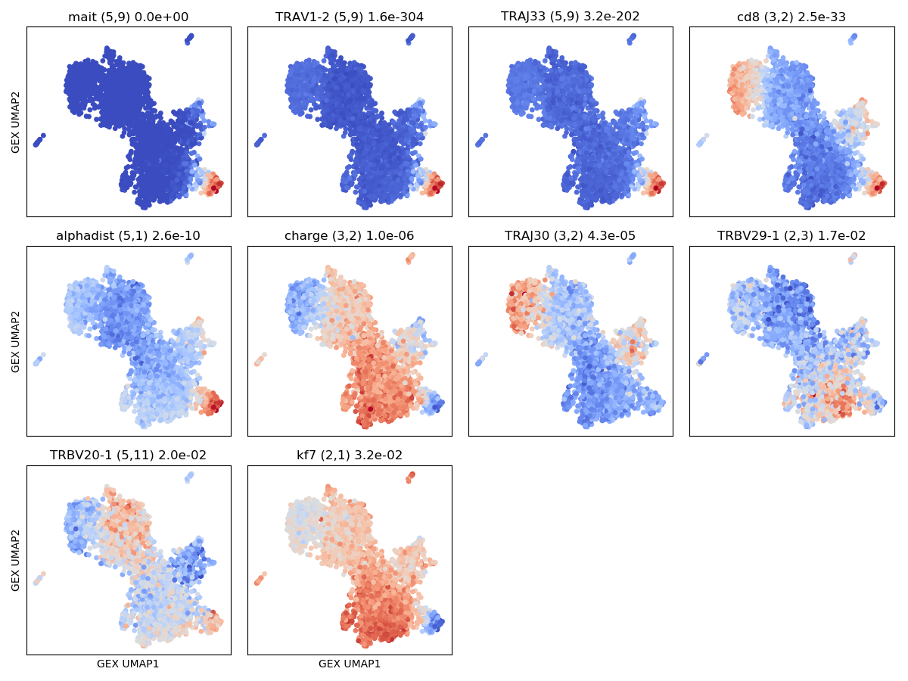
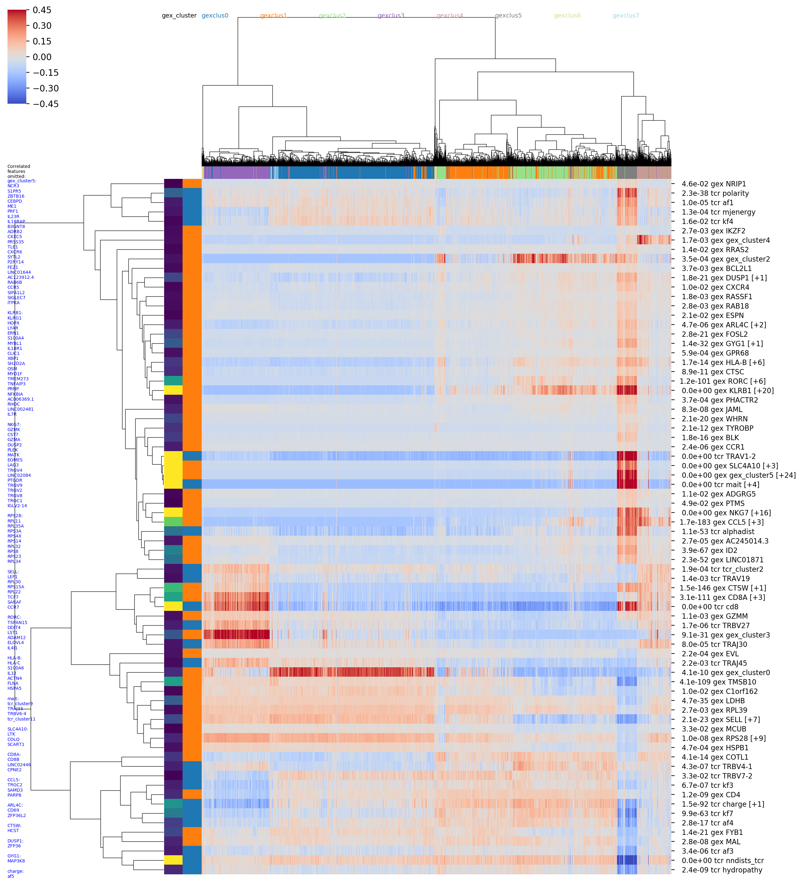
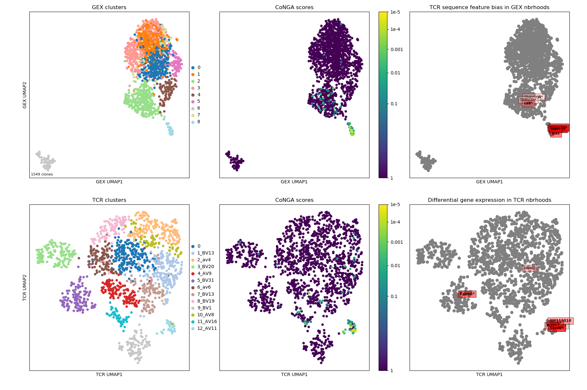
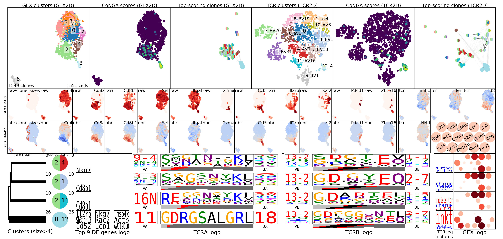
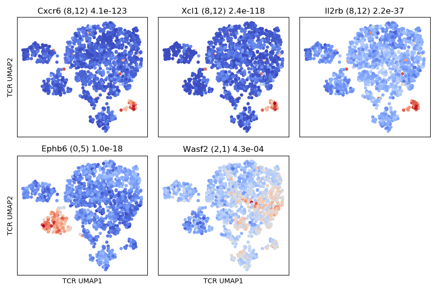
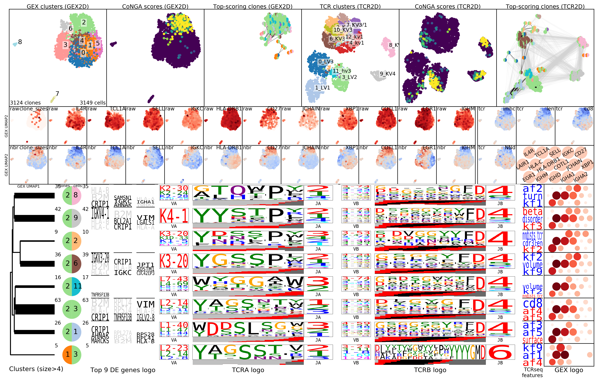
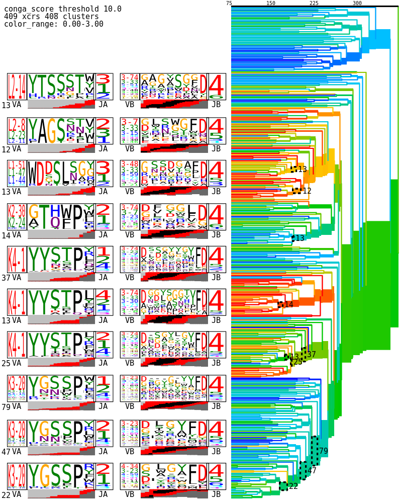

# Clonotype Neighbor Graph Analysis (CoNGA) -- pre-beta

This repository contains the `conga` python package and associated scripts
and workflows. `conga` was developed to detect correlation between
T cell gene expression profile and TCR sequence in single-cell datasets. We've just
recently added support for gamma delta TCRs and for B cells, too.
`conga` is in active development right now so the interface may change in
the next few months. Questions and requests can be directed to `pbradley` at `fredhutch` dot `org` or
`stefan.schattgen` at `stjude` dot `org`.

Further details on `conga` can be found in the preprint entitled
**"Linking T cell receptor sequence to transcriptional profiles with clonotype neighbor graph analysis (CoNGA)"**
by Stefan A. Schattgen, Kate Guion, Jeremy Chase Crawford, Aisha Souquette, Alvaro Martinez Barrio, Michael J.T. Stubbington,
Paul G. Thomas, and Philip Bradley, accessible on the bioRxiv server
[here](https://www.biorxiv.org/content/10.1101/2020.06.04.134536v1).

# Table of Contents

* [Running](https://github.com/phbradley/conga#running)
* [Installation](https://github.com/phbradley/conga#installation)
* [Migrating Seurat data to CoNGA](https://github.com/phbradley/conga#migrating-seurat-data-to-conga)
* [Updates](https://github.com/phbradley/conga#updates)
* [SVG to PNG](https://github.com/phbradley/conga#svg-to-png)
* [Examples](https://github.com/phbradley/conga#examples)
* [The CoNGA data model: where stuff is stored](https://github.com/phbradley/conga#conga-data-model-where-stuff-is-stored)

# Running

Running `conga` on a single-cell dataset is a two- (or more) step process, as outlined below.
Python scripts are provided in the `scripts/` directory but analysis steps can also be accessed interactively
in jupyter notebooks (for example, [a simple pipeline](simple_conga_pipeline.ipynb) and
[Seurat to conga](Seurat_to_Conga.ipynb) in the top directory of this repo)
or in your own python scripts through the interface in the `conga` python package.
There's also a [google colab notebook](colab_conga_pipeline.ipynb) which you can
[](https://colab.research.google.com/github/phbradley/conga/blob/master/colab_conga_pipeline.ipynb) and run. If you want to
experiment before installing CoNGA locally you can save a copy of that notebook
to your google drive, edit and run the pipeline, either on the provided examples or on
data that you upload to the colab instance.
The examples in the `examples/` folder described below and in the jupyter notebooks feature publicly available data from 10x Genomics,
which can be downloaded in a single
[zip file](https://www.dropbox.com/s/r7rpsftbtxl89y5/conga_example_datasets_v1.zip?dl=0) or at the
[10x genomics datasets webpage](https://support.10xgenomics.com/single-cell-vdj/datasets/).

1. **SETUP**: The TCR data is converted to a form that can be read by `conga` and then
a matrix of `TCRdist` distances is computed. KernelPCA is applied to this distance
matrix to generate a PC matrix that can be used in clustering and dimensionality reduction. This
is accomplished with the python script `scripts/setup_10x_for_conga.py` for 10x datasets. For example:

```
python conga/scripts/setup_10x_for_conga.py --filtered_contig_annotations_csvfile vdj_v1_hs_pbmc3_t_filtered_contig_annotations.csv --organism human
```

2. **ANALYZE**: The `scripts/run_conga.py` script has an implementation of the main pipeline and can be run
as follows:

```
python conga/scripts/run_conga.py --graph_vs_graph --gex_data data/vdj_v1_hs_pbmc3_5gex_filtered_gene_bc_matrices_h5.h5 --gex_data_type 10x_h5 --clones_file vdj_v1_hs_pbmc3_t_filtered_contig_annotations_tcrdist_clones.tsv --organism human --outfile_prefix tmp_hs_pbmc3
```

3. **RE-ANALYZE**: Step 2 will generate a processed `.h5ad` file that contains all the gene expression
and TCR sequence information along with the results of clustering and dimensionality reduction. It can then
be much faster to perform subsequent re-analysis or downstream analysis by "restarting" from those files.
Here we are using the `--all` command line flag which requests all the major analysis modes:

```
python conga/scripts/run_conga.py --restart tmp_hs_pbmc3_final.h5ad --all --outfile_prefix tmp_hs_pbmc3_restart
```

See the examples section below for more details.

# Installation

`conga` relies heavily on the wonderful `scanpy` python package for single-cell analysis. See the `scanpy`
instructions for installation: <https://scanpy.readthedocs.io/en/stable/installation.html>.
We highly recommend using anaconda/miniconda for managing python environments. The calculations in the
`conga` manuscript were conducted with the following package versions:

```
scanpy==1.4.3 anndata==0.6.18 umap-learn==0.3.9 numpy==1.16.2 scipy==1.2.1 pandas==0.24.1 scikit-learn==0.20.2 statsmodels==0.9.0 python-igraph==0.7.1 louvain==0.6.1
```

which might possibly be installed with the following `conda` command:
```
conda create -n conga_classic_env ipython python=3.6 scanpy=1.4.3 umap-learn=0.3.9 louvain=0.6.1
```


We've also been able to re-run everything, albeit with some numerical changes, with a current (2020-05-25) scanpy
installation and these package versions:
```
scanpy==1.5.1 anndata==0.7.3 umap-learn==0.4.3 numpy==1.17.5 scipy==1.4.1 pandas==1.0.3 scikit-learn==0.23.1 statsmodels==0.11.1 python-igraph==0.8.2 louvain==0.6.1 leidenalg==0.8.0
```

Which was installed with the following `conda` commands (following the `scanpy` docs):
```
conda create -n conga_new_env ipython python=3.6
conda activate conga_new_env   # or: "source activate conga_new_env" depending on your conda setup
conda install seaborn scikit-learn statsmodels numba pytables
conda install -c conda-forge python-igraph leidenalg louvain
conda install -c intel tbb # optional
pip install scanpy
pip install fastcluster # optional
```

(And consider also adding `conda install -c conda-forge notebook` for Jupyter notebook stuff.)

(If you do not have the command line tool `convert` from Imagemagick, or Inkscape, installed, you
could also add `conda install -c conda-forge imagemagick`. See the section below on SVG to PNG
conversion for more details.)

Preliminary results suggest that, at least with default clustering parameters, the older `louvain`
clustering algorithm seems to give slightly 'better' results than the newer `leiden` algorithm,
ie finds a few more GEX/TCR associations, probably because there seem to be fewer, larger clusters.
If the `louvain` package is installed `conga` will use that.

Next, clone the `conga` repository (type this command wherever you want the `conga/` directory to appear):
```
git clone https://github.com/phbradley/conga.git
```

*NEW* We recently added a C++ implementation of TCRdist to speed neighbor calculations on
large datasets and to compute the background TCRdist distributions for the new
'TCR clumping' analysis. This is not required by the core functionality
described in the original manuscript, but we highly recommend that you compile
the C++ TCRdist code using your C++ compiler.

We've successfullly used `g++` from the GNU Compiler Collection (https://gcc.gnu.org/) to compile on
Linux and MacOS, and from MinGw (http://www.mingw.org/) for Windows.

Using `make` on Linux or MacOS. (You can edit `conga/tcrdist_cpp/Makefile` to
point to a C++ compiler other than `g++`)
```
cd conga/tcrdist_cpp
make
```
Or without `make` (for Windows)
```
cd conga/tcrdist_cpp
g++ -O3 -std=c++11 -Wall -I ./include/ -o ./bin/find_neighbors ./src/find_neighbors.cc
g++ -O3 -std=c++11 -Wall -I ./include/ -o ./bin/calc_distributions ./src/calc_distributions.cc
g++ -O3 -std=c++11 -Wall -I ./include/ -o ./bin/find_paired_matches ./src/find_paired_matches.cc
```

# Migrating Seurat data to CoNGA
We recommend using the write10XCounts function from the DropletUtils package for
converting Seurat objects into 10x format for importing into CoNGA/scanpy.
```
require(Seurat)
require(DropletUtils)
hs1 <- readRDS('~/vdj_v1_hs_V1_sc_5gex.rds')
# write out for conga
write10xCounts(x = hs1@assays$RNA@counts, path = './hs1_mtx/')
# import the hs1_mtx directory into CoNGA using the '10x_mtx' option
```

# Updates

* 2021-01-21: (EXPERIMENTAL) New mode of analysis in which the paired TCR
sequences in the analyzed dataset are matched to paired sequences in a literature-derived
database compiled from VDJdb, McPAS, the large 10x dextramer dataset,
the protein structure databank, and a few other studies. See the database
[README](conga/data/new_paired_tcr_db_for_matching_nr_README.txt) for citation
details and the
[database itself](conga/data/new_paired_tcr_db_for_matching_nr.tsv).
This mode of analysis is included in `scripts/run_conga.py --all` or with
the `--match_to_tcr_database` flag. Or from within the `conga` package
using the `conga.tcr_clumping.match_adata_tcrs_to_db_tcrs` function.
You can also pass in a user-provided paired TCR sequence database for matching
against using the
`run_conga.py` command line flag `--tcr_database_tsvfile` or the second
argument to the `conga.tcr_clumping.match_adata_tcrs_to_db_tcrs`
function. The statistical significance of matches is evaluated using the
same background `tcrdist` calculations that go into the 'TCR clumping'
analysis described below (which incidentally means that this mode
requires compilation of the C++ tcrdist executable as described in
the installation section above).

* 2020-12-31: (EXPERIMENTAL) New mode of analysis, TCR clumping, to detect
clustered regions of TCR space. This mode will identify TCR clonotypes that have
more TCRdist neighbors at specified distance thresholds in the analyzed dataset
than would be expected by chance under
a simple null model based on shuffling the observed alpha-beta and V-J pairings
while (mostly) preserving V(D)J rearrangement statistics. Accessed through the
`conga/scripts/run_conga.py` script with the flag `--tcr_clumping` or when
using `--all` to run all major analyses. Also accessible in the python package
via the `conga.tcr_clumping.assess_tcr_clumping` routine. Note that this
analysis does not use the GEX information at all. Inspired by ALICE from Walczak
and Mora and TCRnet from the VDJtools folks.

* 2020-12-31: C++ implementation of TCRdist distance calculations for speed and
to power the 'TCR clumping' analysis. Requires C++ compiler. Code is stored in
`conga/tcrdist_cpp` and compiled as described above in the Installation section.

* 2020-09-16: (EXPERIMENTAL) Added a preliminary implementation of the
Hotspot autocorrelation algorithm developed by the Yosef lab, for finding informative features
in multi-modal data (check out the [github repo](https://github.com/YosefLab/Hotspot)
and the [bioRxiv preprint](https://www.biorxiv.org/content/10.1101/2020.02.06.937805v1)).
Hotspot finds numerical features whose pattern of variation across a single-cell
dataset respects a user-supplied notion of cell-cell similarity (a neighbor graph
with edge weights). We are using Hotspot to identify genes that respect the TCR
neighbor graph, and TCR features that respect the gene expression neighbor
graph (see examples in the Examples section below).

* 2020-09-16: Added a simple script for merging multiple datasets
(`scripts/merge_samples.py`). More functionality to
come in the future; for the time being this will merge multiple datasets that each could
be run through conga individually (ie clones files have already been generated with
associated .barcode_mapping.tsv and kernel PCA files, and the barcodes in the barcode
mapping files match those in the GEX data files. These conditions will be satisfied if
each was generated by `scripts/setup_10x_for_conga.py`). The input to the script
is a tab-separated values `.tsv` file with three columns (corresponding to the three
input arguments for `scripts/run_conga.py`: `clones_file` `gex_data` and `gex_data_type`)
which give the locations of the clonotype and gene expression data files.
If these datasets are from the same individual and/or could contain cells from the
same expanded clonotypes it might be worth using the arguments `--condense_clonotypes_by_tcrdist
--tcrdist_threshold_for_condensing 0.01` which will merge clonotypes containing identical
TCR sequences (for BCRs a larger tcrdist threshold value of 50ish might make sense).

* 2020-09-04: (EXPERIMENTAL) Added support for bcrs and for gamma-delta TCRs. Right now `conga` uses the
`'organism'` specifier to communicate the data type: `human` and `mouse` mean alpha-beta TCRs;
`human_gd` and `mouse_gd` mean gamma-deltas; `human_ig` means B cell data (not setup for mouse
yet but let us know if that's of interest to you, for example by opening an Issue on github).
Hacking the organism field like this allows us to put all the gene sequence information into a single,
enlarged database file (`conga/tcrdist/db/combo_xcrs.tsv`). We still haven't updated all the
image labels and filenames, so even though you are analyzing BCR data your plots will probably
still say TCR in a few places...

# svg to png
The `conga` image-making pipeline requires an svg to png conversion. There seem to be a variety of
options for doing this, with the best choice being somewhat platform dependent. We've had good luck with
ImageMagick `convert` (on Linux, MacOS, and Windows) and Inkscape (on mac).

On Mac, we recommend installing ImageMagick using Homebrew with:
`brew install imagemagick`

or via conda:
`conda install -c conda-forge imagemagick`

On Windows, we recommend the self-installing executable available from ImageMagick:
(https://imagemagick.org/script/download.php)

The conversion is handled in the file `conga/convert_svg_to_png.py`, so you can modify that file if things are
not working and you have a tool installed; `conga` may not be looking in the right place. Also if the fonts
in the TCR/BCR logos look bad you could try switching the MONOSPACE_FONT_FAMILY
variable in that python file (see comments at the top of the file).

# Examples
Shell scripts for running `conga` on three publicly available 10X
genomics datasets can be found in the `examples/` directory:
[`examples/setup_all.bash`](examples/setup_all.bash) which preprocesses the
clonotype data, and [`examples/run_all.bash`](examples/run_all.bash) which calls
`scripts/run_conga.py` on the three datasets. Here we discuss some of the
key outputs. For details on the algorithm and additional details on the plots,
refer to our [bioRxiv preprint](https://www.biorxiv.org/content/10.1101/2020.06.04.134536v1).
Here we focus on images, but the results of the different analysis
modes are also saved in a variety of tab-separated-values (`*.tsv`) files.
You can download a [zip file](https://www.dropbox.com/s/r7rpsftbtxl89y5/conga_example_datasets_v1.zip?dl=0)
containing all three datasets. Or access them individually from the 10x website
at the locations given below.

## Human PBMC dataset

```
# DOWNLOAD FROM:
# https://support.10xgenomics.com/single-cell-vdj/datasets/3.1.0/vdj_v1_hs_pbmc3

# SETUP
/home/pbradley/anaconda2/envs/scanpy_new/bin/python /home/pbradley/gitrepos/conga/scripts/setup_10x_for_conga.py --organism human --filtered_contig_annotations_csvfile ./conga_example_datasets/vdj_v1_hs_pbmc3_t_filtered_contig_annotations.csv

# RUN
/home/pbradley/anaconda2/envs/scanpy_new/bin/python /home/pbradley/gitrepos/conga/scripts/run_conga.py --all --organism human --clones_file ./conga_example_datasets/vdj_v1_hs_pbmc3_t_filtered_contig_annotations_tcrdist_clones.tsv --gex_data ./conga_example_datasets/vdj_v1_hs_pbmc3_5gex_filtered_gene_bc_matrices_h5.h5 --gex_data_type 10x_h5 --outfile_prefix tcr_hs_pbmc

```

NOTE: In the `RUN` command above the `--all` argument to `run_conga.py` is a shorthand
for running all the current major modes of analysis, and is equivalent (right now)
to `--graph_vs_graph --graph_vs_gex_features --graph_vs_tcr_features --cluster_vs_cluster --find_hotspot_features --find_gex_cluster_degs --make_tcrdist_trees`.

In looking at the CoNGA results a good place to start is with the summary image,
which will be named something
like `OUTFILE_PREFIX_summary.png` where `OUTFILE_PREFIX` was the `--outfile_prefix`
command line argument passed to `run_conga.py`. This image shows 2D projections of the
clonotypes in the dataset, based on distances in gene expression (GEX) space in
the top row and in TCR/BCR space in the bottom row. The left panels are colored
by clonotype clusters (GEX clusters on top and TCR clusters on the bottom);
the middle panels are colored by CoNGA score, which reflects overlap
between the GEX and TCR neighbor graphs on a per-clonotype basis; and the right
panels are overlaid with the top graph-vs-feature hits: TCR features that are
enriched in GEX graph neighborhoods on top, and genes that are differentially
expressed in TCR graph neighborhoods on the bottom.



To gain greater insight into the clonotypes with significant CoNGA scores,
the software groups them by their joint GEX and TCR cluster assignments and
displays logos that summarize gene expression and TCR V/J gene usage and CDR3
sequence features for groups with size above a threshold (by default, at least
5 clonotypes and .1% of the overall dataset size). These logos are shown in the
plot `OUTFILE_PREFIX_bicluster_logos.png`. In this image the top panels are
show the clusters, conga scores, and conga hits (clonotypes with conga score<1)
in the GEX (left 3 panels) and TCR/BCR (right 3 panels) 2D lanscapes. Below
them are shown a sequence of thumbnail GEX projection scatter plots colored by
selected (and user configurable) marker genes; the top set are colored by raw
(normalized for cell reads and log+1 transformed) expression and in the bottom
set those values are Z-standardized and averaged over GEX graph neighborhoods,
to smooth and highlight overall trends. Below the snapshots are the rows of
cluster-pair (or 'bicluster') logos.


The results of the graph-vs-features analysis are summarized in a number of graphs
with names that include text like `graph_vs_XXX_features`. For example, the
top few TCR/GEX feature hits are shown projected onto the other landscape
(ie, TCR features onto the GEX landscape and GEX features onto the TCR landscape)
in plots that end in `_panels.png`, like the
`OUTFILE_PREFIX_gex_nbr_graph_vs_tcr_features_panels.png` shown below, where we can
see MAIT-cell features as well as features that differ between CD4 and CD8 T cells
(charge, TRBV20 and TRAJ30 usage). You can identify the CD4/CD8 cells by looking
at the CD4/CD8a/CD8b gene thumbnails in the cluster logos plot above.  



In addition to the graph-vs-feature analysis described in the preprint,
we recently implemented a first, experimental version of the
[HotSpot](https://github.com/YosefLab/Hotspot) method
developed by the Yosef lab
([bioRxiv preprint](https://www.biorxiv.org/content/10.1101/2020.02.06.937805v1)).
Hotspot identifies numerical features that respect a given neighbor graph
structure, so we can use it to identify GEX features that correlate with
the TCR similarity graph and TCR/BCR features that correlate with the the
GEX similarity graph. These features are saved to `tsv` files and visualized
in a number of images, including `seaborn clustermap` plots if you have the
`seaborn` package installed. For example the image with the rather long
name
`OUTFILE_PREFIX_0.100_nbrs_combo_hotspot_features_vs_gex_clustermap_lessredundant.png`
shows the top combined GEX and TCR features (rows) versus clonotypes (columns), where the
clonotypes (columns) are ordered based on a hierarchical clustering dendrogram
built using GEX similarity (`_vs_gex_clustermap` in filename) and the scores
are averaged over GEX neighborhoods
(so that visible trends need to be consistent the GEX graph structure, and to smooth
noise). Features that are highly correlated with another, more significant
feature are filtered out and listed in the tiny blue text on the left (`_lessredundant` in
the filename). In this plot we can see MAIT, CD4, and CD8 groupings and many of the
same features as in the graph-vs-features analysis above. Since we have only
implemented the simplest model right now, the P-values may not be completely
trustworthy, and we suggest focusing on the results from larger neighbor
graphs (here we are showing the results for the graph with 0.1 neighbor fraction,
`_0.100_nbrs` in the filename,
ie where each clonotype is connected to the nearest 10 percent of the dataset).
The colors along the top of the matrix show the GEX cluster assignments of
each clonotype. The two columns of colors along the left-hand side of the matrix
show (left column) the P-value and (right column) the feature type (GEX vs TCR)
of the feature corresponding to that row (P-values and feature types are also
given in the row names along the right-hand side of the matrix). '[+N]' in the
row name means that N additional highly-correlated features were filtered out;
their names will be listed in the tiny blue text along the left-hand side of the
figure, listed below the name of the representative feature. (Some of these images
are big and very detailed-- downloading or opening in a separate tab and zooming
in may be helpful).



## Mouse PBMC dataset

```
# DOWNLOAD FROM:
# https://support.10xgenomics.com/single-cell-vdj/datasets/3.0.0/vdj_v1_mm_balbc_pbmc_5gex

# SETUP
/home/pbradley/anaconda2/envs/scanpy_new/bin/python /home/pbradley/gitrepos/conga/scripts/setup_10x_for_conga.py --organism mouse --filtered_contig_annotations_csvfile ./conga_example_datasets/vdj_v1_mm_balbc_pbmc_t_filtered_contig_annotations.csv

# RUN
/home/pbradley/anaconda2/envs/scanpy_new/bin/python /home/pbradley/gitrepos/conga/scripts/run_conga.py --all --organism mouse --clones_file ./conga_example_datasets/vdj_v1_mm_balbc_pbmc_t_filtered_contig_annotations_tcrdist_clones.tsv --gex_data ./conga_example_datasets/vdj_v1_mm_balbc_pbmc_5gex_filtered_gene_bc_matrices_h5.h5 --gex_data_type 10x_h5 --outfile_prefix tcr_mm_pbmc
```

The summary image, where we can see a tight cluster of conga hits that turn out
to be iNKT cells (inkt TCR feature enriched in top right panel), some CD8-enriched
genes (TRAV16N and TRBV29), and the EphB6 gene which turns out to be correlated
with usage of the TRBV31 gene:


Here the cluster logo image shows iNKT cells and some CD8-positive clusters that
likely reflect TCR sequence features shared by CD8s.



The top few GEX features that are enriched in TCR neighborhoods: some iNKT genes
and the EphB6 gene showing localized expression in the TCR landscape projection
(in the TRBV31 expressing clonotypes).



In the hotspot clustermap showing features versus TCR-arranged clonotypes we
can see the correlation between EphB6 and TRBV31 nicely. The color rows along the
top of the matrix show (from top to bottom) the TCR cluster assignment and the
TRAV, TRAJ, TRBV, and TRBJ gene segment usage patterns (color key for the top
few genes is shown at the top of the column dendrogram).


## Human Melanoma B cell dataset

```
# DOWNLOAD FROM:
# https://support.10xgenomics.com/single-cell-vdj/datasets/4.0.0/sc5p_v1p1_hs_melanoma_10k

# SETUP
/home/pbradley/anaconda2/envs/scanpy_new/bin/python /home/pbradley/gitrepos/conga/scripts/setup_10x_for_conga.py --organism human_ig --filtered_contig_annotations_csvfile ./conga_example_datasets/sc5p_v1p1_hs_melanoma_10k_b_filtered_contig_annotations.csv --condense_clonotypes_by_tcrdist --tcrdist_threshold_for_condensing 50

# RUN
/home/pbradley/anaconda2/envs/scanpy_new/bin/python /home/pbradley/gitrepos/conga/scripts/run_conga.py --all --organism human_ig --clones_file ./conga_example_datasets/sc5p_v1p1_hs_melanoma_10k_b_filtered_contig_annotations_tcrdist_clones_condensed.tsv --gex_data ./conga_example_datasets/sc5p_v1p1_hs_melanoma_10k_filtered_feature_bc_matrix.h5 --gex_data_type 10x_h5 --outfile_prefix bcr_hs_melanoma
```

Two features to note in the commands above: (1) we are passing `--organism human_ig`
to let conga know we are working with BCR data, (2) in the setup command we
added the flags `--condense_clonotypes_by_tcrdist --tcrdist_threshold_for_condensing 50`,
which trigger merging of 10X clonotypes whose TCRdist (actually BCR dist) is
less than or equal to 50 (ie, we do single-linkage clustering and cut the tree
at a distance threshold of 50). Here the goal is to merge clonally related
families so that GEX/BCR covariation that we detect reflects the correlation
across independent rearrangements. The user could instead apply a more
sophisticated clone identification procedure and modify the `raw_clonotype_id`
column in the contigs csv file, which is where conga gets the clonotype info.

The summary image, where we can see that most of the conga hits are in GEX cluster
2; that there are differences in CDR3 length across the landscape; and some
specific genes that are differentially expressed in TCR graph neighborhoods
(TNFRSF13B, B2M, CRIP1).


Logos for the clusters of conga hits, with one cluster of 'naive' clonotypes
with long CDRH3s and high TCL1A expression.



In the hotspot clustermap showing features versus TCR-arranged clonotypes we
can see a breakdown between naive and non-naive features, where IGHJ6 and CDR3 length
are correlated with genes like TCL1A and class II HLA genes, and IGHJ4 is enriched
in the non-naives.


CoNGA also makes a tree of all the clonotypes with a conga score less than a
loose threshold value of 10, where we can look for sequence clustering. The branches
are colored by a transformed version of the conga score that maps the threshold
value of 10 to zero (blue) with more significant scores trending toward red at
a value of 1e-8:



# CoNGA data model: where stuff is stored

After setup, the conga package stores data in various locations
in the `scanpy` `AnnData` object. Below we assume that `adata` is
the name of the AnnData object where the GEX and
TCR data is stored (this is the naming
convention followed in CoNGA).

## The core stuff
CoNGA functionality like graph-vs-graph and graph-vs-feature analyses will
generally expect these to be set once the setup phase has completed. The
CoNGA routines that fill these arrays are:
* `conga.preprocess.read_data`: loads the GEX data into an `AnnData` object
(here called `adata`); puts the TCR information into the `adata.obs` arrays;
reads the TCRdist kernel principal components and stores them in `adata.obsm` under
the key `X_pca_tcr`. Eliminates cells without paired TCR information.
* `conga.preprocess.filter_and_scale`: sets up the `adata.raw` object, does
some typical single-cell filtering and preprocessing.
* `conga.preprocess.reduce_to_single_cell_per_clone`: reduces to a single
cell per clonotype; fills the `adata.obs['clone_sizes']` array and
potentially `adata.obsm[<batch_key>]` for one or more `<batch_key>`s if
there is batch structure defined in the input data.
* `conga.preprocess.cluster_and_tsne_and_umap`: Fills `adata.obsm['X_pca_gex']`,
and the `adata.obs` arrays `X_gex_2d`, `X_tcr_2d`, `clusters_gex`,
and `clusters_tcr`.

### `adata.obs`
The following 1-D arrays are stored in the `obs` array and can be accessed
with expressions like `adata.obs['va']`

* `va`: V gene names, alpha chain
* `ja`: J gene names, alpha chain
* `cdr3a`: CDR3 amino acid sequences, alpha chain
* `cdr3a_nucseq`: CDR3 nucleotide sequences, alpha chain
* `vb`: V gene names, beta chain
* `jb`: J gene names, beta chain
* `cdr3b`: CDR3 amino acid sequences, beta chain
* `cdr3b_nucseq`: CDR3 nucleotide sequences, beta chain
* `clusters_gex`: GEX cluster assignments, integers, range `[0, num_clusters)`
* `clusters_tcr`: TCR cluster assignments, integers, range `[0, num_clusters)`
* `clone_sizes`: The number of cells in each clonotype.


### `adata.obsm`
The following multidimensional arrays are stored in the `obsm` array after
setup.

* `X_pca_gex`: The GEX principal components. Used for neighbor-finding,
UMAP projections, etc.
* `X_pca_tcr`: The TCRdist kernel principal components. May be missing if
we are using the 'exact TCRdist neighbors' mode, which is useful for really
big datasets where the kernel PCA calculation takes forever.
* `X_gex_2d`: The 2D landscape projection based on GEX (UMAP by default).
* `X_tcr_2d`: The 2D landscape projection based on TCR (UMAP by default).

### `adata.uns`
These miscellaneous data are stashed in the `adata.uns` dictionary:

* `organism`: A string indicating what type of TCR/BCR data is being analyzed.
CoNGA currently supports the following choices:
    - `human`: human alpha-beta TCRs
    - `mouse`: mouse alpha-beta TCRs
    - `human_gd`: human gamma-delta TCRs
    - `mouse_gd`: mouse gamma-delta TCRs
    - `human_ig`: human BCRs

### `adata.raw`
This is where the raw data on gene expression is expected to live.

* `adata.raw.X` Sparse matrix with the gene expression values for each gene.
These will have been normalized to sum to 10,000 and then `np.log1p`'ed (had the natural logarithm taken after adding 1).
* `adata.raw.var_names` The gene names; should match the number of columns in
`adata.raw.X`.

### GEX and TCR neighbors
Currently the neighborhood information is stored independently of the
`adata` object, in a dictionary called `all_nbrs`. The keys of this
dictionary are the neighborhood fractions aka `nbr_fracs`, floats that
represent the size of the neighborhood as a fraction of the total number
of clonotypes. The default `nbr_fracs` are `[0.01, 0.1]`. For each `nbr_frac`,
`all_nbrs[nbr_frac] = [gex_nbrs, tcr_nbrs]` where `gex_nbrs` and `tcr_nbrs`
are `numpy` arrays of shape `(num_clonotypes,num_nbrs)`, and
`num_nbrs = int(nbr_frac*num_clonotypes)`. Note that a clonotype is not
included in its own set of neighbors. Also note that the CoNGA neighbor
information is distinct from neighbor information
that `scanpy` uses for UMAP projection and clustering.
CoNGA neighborhoods are larger than the neighborhoods typically used
in clustering and dimensionality reduction.

## Extras
This might be results of calculations that are stored for easier access,
or optional data that is present in certain circumstances
(for example when there are batches present).
It should be OK if any of these are missing.

### `adata.obs`
The following 1-D arrays are stored in the `obs` array and can be accessed
with expressions like `adata.obs['va']`

* `is_invariant`: Boolean array recording the presence of
canonical invariant (MAIT or iNKT) TCR chains.
* `nndists_tcr`: Nearest-neighbor distances based on TCR sequence.
Gives an approximate measure of (inverse) TCR density.
* `nndists_gex`: Nearest-neighbor distances based on GEX.
Gives an approximate measure of (inverse) GEX density.
* `conga_scores`: CoNGA scores for each clonotype.
Filled after the graph-vs-graph analysis has been run.
* `<batch_key>`: When there are multiple batches present in a dataset
these can be tracked and visualized in many of the analysis
and plotting routines.
Here `<batch_key>` is the name of the batch/category (for example `'outcome'` or `'subject'` or `'timepoint'`).
The entry in `adata.obs` for each batch key should contain integers in the range `[0,num_batch_classes)`.
This information is stored in the `adata.obs` array *prior* to condensing to a single
cell per clonotype, and in the `adata.obsm` array *after* condensing to a single cell per clonotype
(since expanded clonotypes can span multiple batch assignments).
See the FAQ entry on batches in CoNGA (coming soon).

### `adata.obsm`
The following multidimensional arrays are stored in the `obsm` array and can be accessed
with expressions like `adata.obsm[<tag>]`

* `<batch_key>`: When there are multiple batches present in a dataset
these can be tracked and visualized in many of the analysis
and plotting routines.
Here `<batch_key>` is the name of the batch/category (for example `'outcome'` or `'subject'` or `'timepoint'`).
For each `<batch_key>`, the array stored in `adata.obsm` should have shape
`(num_clonotypes,num_categories)` where `num_categories` is the number of possible
batch assignments. For example if there are three timepoints then `num_categories` for the `'timepoint'` batch key would be 3.
The `(i,j)` entry in the array will give the number of cells in clonotype `i` that were
assigned to the batch assignment `j`.
This array is filled automatically when we reduce to a single cell per clonotype,
based on the information in the array `adata.obs[<batch_key>]` (see above).
See the FAQ entry on batches in CoNGA (available soon).

### `adata.uns`
* `batch_keys`: A list of strings that gives the names of the different
batch types/categories, if present (for example something like `['subject', 'outcome', 'timepoint']`.
For each name in `adata.uns['batch_keys']` there should be
an entry in the `adata.obs` array with that name (see above for description of that data).
When we condense to a single cell per clonotype,
we add an entry in the `adata.obsm` array with the same name, which contains the counts
for each batch assignment summed over
all the cells in each clonotype (so it's a 2D array and hence has to be stored in `obsm` not `obs`.

### `adata.var`
* `feature_types`: This array is used to detect and exclude
antibody (site-seq) or other non-gene-expression
features. If it's missing, then during setup CoNGA will assume that
all the counts in the `adata.X` array are gene-expression features.
The expected value for gene expression features in this
array is the string `'Gene Expression'`. CoNGA will look for and use any column
in the `adata.var` array whose name starts with
`feature_types` (since sometimes they get renamed during concatenation).
